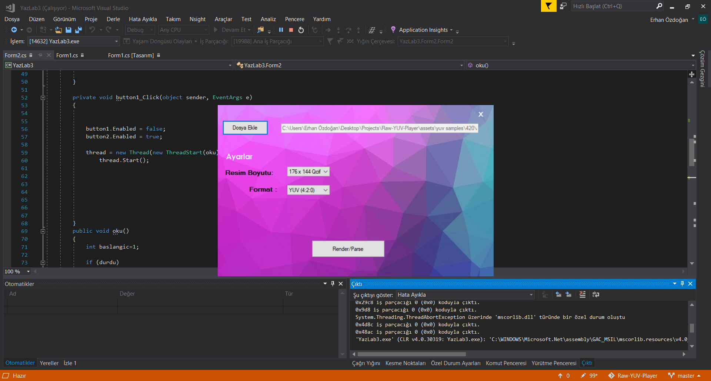
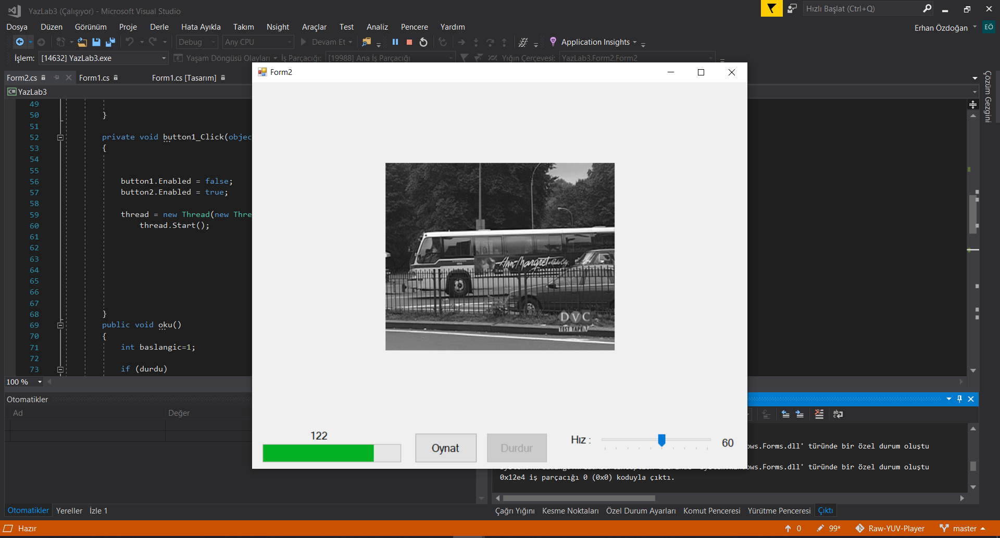

# Raw-YUV-Player

### Converter From Raw yuv File To BMP Images.

This app converts raw yuv files to BMP frames and plays them as a video. YUV formats can be 4:2:0, 4:2:2, 4:4:4 and resolution can be 176x144 (Qcif), 352x288 (Cif) and 720x576. Users can pause/resume and speed up/ slow down while video is playing

### Raw File,Format and Resolution Choosing

### Video Player

